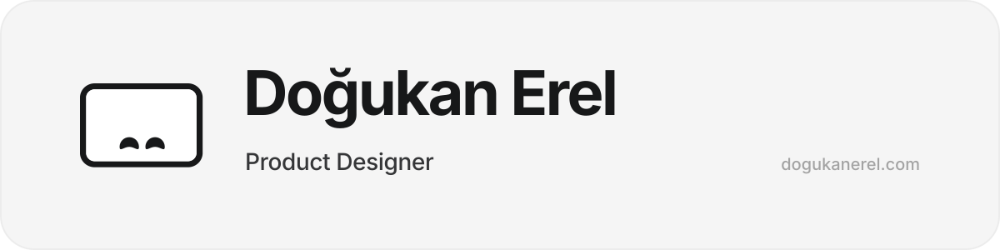

  
    
  

## Hi, I'm Doğukan

I'm a product designer with **7+ years** crafting complex web and mobile apps, mostly in **sport, health, education and legal tech**. I build design systems, ship interfaces in code, and try to make the work feel a little like play — less noise, more outcome.

## Now

|                |                                                                |
| :------------- | :------------------------------------------------------------- |
| **Focus**      | Intellectual Property Intelligence                             |
| **Company**    | [Marqby](https://marqby.com)                                   |
| **Location**   | Ankara, Türkiye · GMT+3                                        |
| **Status**     | Open to new projects                                           |
| **Email**      | [hello@dogukanerel.com](mailto:hello@dogukanerel.com)          |

## Smooti Studio

**Smooti** — thoughtfully made apps for everyday life. *Everyday, made smoother.*

Mobile apps · AI apps · Games

- **Less friction.** Straight to the good part. Clear choices, natural interactions, and nothing getting in your way.
- **More feeling.** The right detail at the right moment. A little warmth. A reason to come back.
- **Care, all the way.** Honest promises. Clear mindset. Respect for your time and your privacy.

[smooti.studio →](https://smooti.studio)

## Tools I use

**Design**  

**AI & code**  

**Productivity**  

## GitHub

  
  

  

  

  
  
  

## Find me

   
  
   
  Everyday, made smoother.

